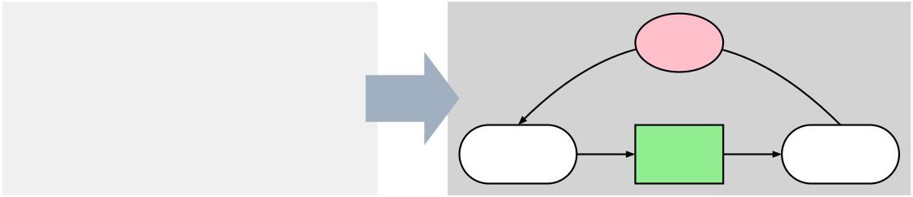

# picjs

Draw diagrams using plain-text descriptions. Embed drawing in (for example)
Markdown.

A bit like Mermaid, but:

* no specific drawing types
* dependable, consistent layout controls based on constraints

<!-- picjs: example
define $t {
  box wid 3 $1 ljust mono ht 35% invis
}

S: [
    down
    $t("oval \"Input\" fill white" ljust)
    $t("arrow" ljust)
    $t("box \"Process\" fill lightgreen" ljust)
    $t("arrow" ljust)
    $t("oval \"Output\" same" ljust)

    $t("arc -> from last oval.n to first oval.n" ljust)
    $t("ellipse at last arc.n fill pink \"Adjust\" \"Weighting\"" ljust)
]

[
line right then up .2 then down .4 right .3 then down.4 left .3 then up .2 then left close fill 0xa0b0c0 color none
]

P: [
    oval "Input" fill white
    arrow
    box "Process" fill lightgreen
    arrow
    oval "Output" same

    arc -> from last oval.n to first oval.n
    ellipse at last arc.n fill pink "Adjust" "Weighting"
]

box at S wid S.wid + .2 ht max(S.ht,P.ht) + .2 fill 0xf0f0f0 color none behind S

box at P wid P.wid + .2 ht max(S.ht,P.ht) + .2 fill lightgrey color none behind S

-->


* [Playground](https://pragdave-devo.github.io/picjs/)
* [Guide](https://pragdave-devo.github.io/picjs/Guide/)
* [Reference](https://pragdave-devo.github.io/picjs/Reference/)

## For The Impatient

1. Load the library
  ``` html
  <script src="https://cdn.jsdelivr.net/npm/jspic@0.1.1/dist/jspic.umd.js"></script>
  ```

2. Search for `picjs` code blocks in the page.
  ``` html
  <script>
    jspic.processCodeBlocks();
</</script>
  ```

3. Make pretty pictures.

  ```html
  <pre><code class="language-jspic">
  box "Hello"
  arrow
  box "World"
  </code></pre>
  ```

# With Thanks

To Brian Kernighan and the folks at Bell Labs who wrote the amazing
Designers Work Bench over fifty years ago. They changed the way we write
documents profoundly.

And to D. Richard Hipp, who created both SQLite and pikchr, the pic clone on
which this was based.


  # Copyright and License

  Copyright 2026 Devo, Inc

  Licensed under the [Mozilla Public License](LICENSE.md)
