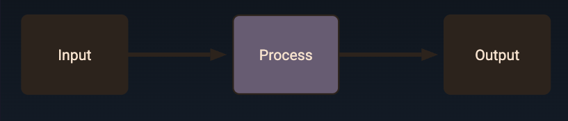
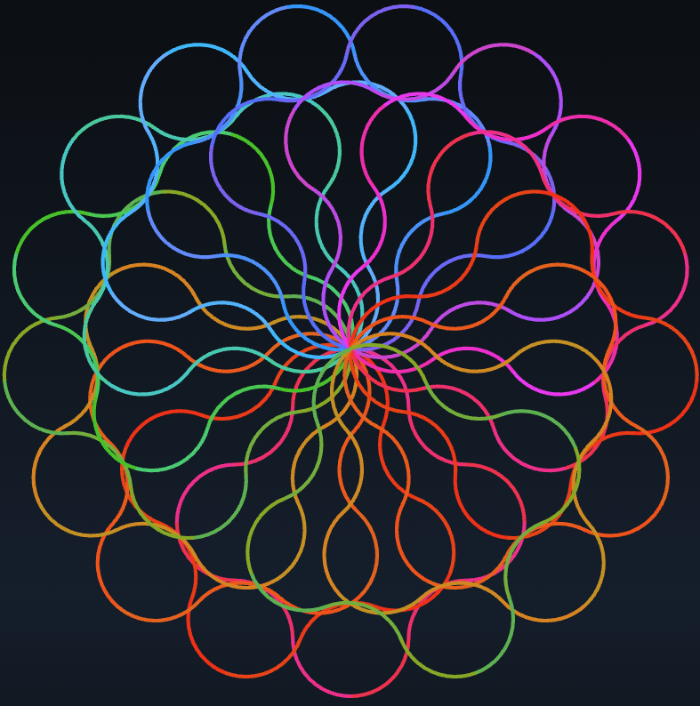

# Picjs: A language for creating animated web graphics.

### Hewllo World!



``` js
Palette.current = "shuksan"
box "Input" -> box "Process" fill ~b2 -> box "Output"
```
picjs supports themes, controlled by the Palette object. Here we select the `shuksan` theme
which defines light and dark versions of six foreground and six background collors. The outer two
boxes use the theme-default background, while the middle box uses the second background color,
`~b2`. 

### Simple Turtle Graphics

<table>
<tr>
<td width="50%">

~~~ js 
petals = 17

start_color = oklch(70%, .3, 0)

petal = (color) => {
  4.times(=> {
    Arc stroke color
    Arc ccw stroke color.spin(10)
    Arc stroke color.spin(20)
  })
}

petals.times(n => {
  Face 360/petals*n     
  petal(start_color.spin(n*30))
})
~~~

</td>
<td width="50%">



</td>
</tr>
</table>

### Run Towers of Hanoi, animating each move:


~~~ js 
NumDisks = 5
Box.pole.fill = ~brown.lighten(5%)  // ~brown is a named color
DiskColor = rgb(220,180,140)


// This is just a regular function, but we're using it to define a mixin

canHaveDisks = (aPole) => {
  disks = []
  aPole.push = (disk) => {
    disks.push(disk)
    // return the position of the bottom of the disk
    aPole.s - (0, disks.length * (disk.ht + 2))
  }
  aPole.pop = () => {
    disks.pop()
  }
}

// draw a pole with a base.

drawPole = (number) => {
  pole = Box 20x150 rad 4 .pole  at (100 + number*230, 300)
  Box .pole 160x20 rx 7.5 at pole.s - (0,10) // the base
  pole.number = number
  canHaveDisks(pole)
  pole
}

poles = [0..2].map(drawPole)

// create the disks and add them to pole #0
[NumDisks..1].each(d => {
  @ += 0.3
  disk =  Box ht 20 wid 40 + d*15 rx 10 ry 5 fill DiskColor.spin(d*40)
  disk.s = poles[0].push(disk)
})

@ += 0.3

moveDisk = (pFrom, pTo) => {
   distance = (pFrom.number - pTo.number).abs()  // will be 1 or 2
   disk = pFrom.pop()
   move disk.s      to pFrom.n - (0, 10) ease "cubicIn"
   then move disk.s to pTo.n - (0, 10)   ease "linear" take 0.3 + 0.3*distance
   then move disk.s to pTo.push(disk)    ease "cubicOut"
   @@
}

hanoi = (n, pFrom, pTo, pVia) => {
 if (n > 0)  {
   hanoi(n-1, pFrom, pVia, pTo)
   moveDisk(pFrom, pTo)
   hanoi(n-1, pVia, pTo, pFrom)
 }
}

hanoi(NumDisks, poles[0], poles[2], poles[1])
~~~


## Features

* Integrates a JavaScript-like language with the drawing and animation DSL

* All values can be extended with attributes, allowing you to implement mixins and to tag shapes
  with extra information

* Functions with closures

* Timeline handling

* Built-in types include boolean, color, font,  function, list, number, position, range, and string. 

* Ranges allow interpolation (`45% * [~red..~blue]` is a color almost halfway between red and blue).

* Shapes may be positioned absolutely or relative to each other. Relative positioning can be one-off,
  or can act as a constraint (if the target shape moves, the dependent shape follows it to maintain the
  constraint.

* Shapes can be grouped together, and groups can be nested. A group becomes shape-like, and so can
  be positioned and animated like any other shape.

* Shapes can be created and destroyed on the timeline

* Attributes can be animated. Where possible, the animation will interpolate the start and end values. Where
  not possible, the animation will do a cross fade (WIP).

* Comes with a browser based environment to let you experiment and debug your code.

## License

See [LICENSE.md](./LICENSE.md).
