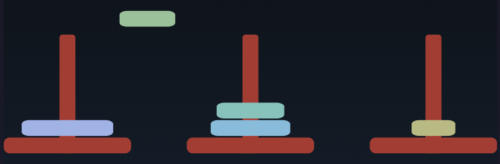

# What's Going On in the Hanoi Code?



The code for the Hanoi animation is a little more complex that the other examples. That's because I
used it as a testbed for language ideas, so it has a little bit of everything mixed in. Let's break
it down.


* We start by setting up some parameters. 

  ~~~ picjs code
  NumDisks = 5
  ~~~

  This is just a regular variable assignment. Change it, and the game updates.

  ~~~ picjs code
  Box.pole.fill = ~brown.lighten(5%) 
  ~~~

  `Box` is the prototype object for boxes. We can use it to set default values for all boxes. If I
  said `Box.fill = ~brown`, then all boxes would be brown. Adding the `.pole` means that only boxes
  tagged with class `pole` will be brown.

  The `~brown` is the name of a color. Picjs has all web colors built in, along with `transparent`.
  It also has 24 theme colors, but I don't use them here. `lighten()` lightens the color, and `5%` is
  just syntactic sugar for `0.05`. 


  ~~~ picjs code
  DiskColor = rgb(220,180,140)
  ~~~

  As well as named colors, you can create colors using `rgb()`, `hsl()`, `oklch()`, along with good
  old hex. Opacity can be set using an optional fourth parameter.

* Every value in picjs can have attributes. Some are predefined (a box has `.width`), but you can
  also add new attributes by assigning to them. Perhaps surprisingly, we can use that simple idea to
  implement a kind of mixin: a function that adds state and functionality to another object.

  ``` picjs code
  canHaveDisks = (aPole) => {
    disks = []
    aPole.push = (disk) => {
        disks.push(disk)
        // return the position of the bottom of the disk
        aPole.s - (0, disks.length * (disk.ht + 2))
    }
    aPole.pop = () => {
        disks.pop()
    }
  }
  ```

  In the Hanoi project, we have three poles, and each pole has a stack of disks. We want each pole
  to be able to push and pop onto and from those stacks, so we write a function that takes a pole
  and;

  * associates a list `disks` with it. Because the `push` and `pop` functions reference `disks`, it
    becomes a closure; each pole gets its own `disks` list.

  * create `push` and `pop` proerties on the pole. Each is a function that delegates to the disk
    stack. The push function also returns the position of the bottom of the disk (which is simply
    the number of disks on the pole times the height of each disk, with a little padding).

* Here's the function that creates a pole.

  ``` picjs code
  drawPole = (number) => {
    pole = Box 20x150 rad 4 .pole  at (100 + number*230, 300)
    Box .pole 160x20 rx 7.5 at pole.s - (0,10) // the base
    pole.number = number
    canHaveDisks(pole)
    pole
  }
  ```

  We position the pole at x=100+number*230, y = 300. The pole is 20x150, with a corner radius of 4.
  The `.pole` is the class (remember, that picks up the style from the Box.pole.fill assignment
  above).

  The base is a horizontal box positioned so that its center is at the south end of the pole (the
  bottom). We overlap them slightly so we don't see the radius on the bottom of the pole.

  We record the pole's number by setting a custom attribute. We then call `canHaveDisks`, which is
  the function we looked at previously. This adds the `push` and `pop` functions to the pole, and
  gives it a `disks` list to manage.

  Finally, we return the pole.

* Create the three poles:

  ``` picjs code
  poles = [0..2].map(drawPole)
  ```

* Create the disks and add them to pole #0:

  ``` picjs code
  [NumDisks..1].each(d => {
    @ += 0.3
    disk =  Box ht 20 wid 40 + d*15 rx 10 ry 5 fill DiskColor.spin(d*40)
    disk.s = poles[0].push(disk)
  })

  @ += 0.3
  ```

  Disk 1 is the smallest, 2 the next biggest, and so on. We want the largest disk to be the first
  one pushed onto pole 0's stack, so we count down from `NumDisks` to 1.

  Now we get to see some animation. I'd like the disks to appear one after the other: just a quick
  initial animation before the disk moving starts.

  The variable `@` is the offset on the timeline. By default, it's 0, but we can change it. When we
  say `@ += 0.3`, we move the time .3 seconds further. Because shapes are displayed at the current
  value of `@`, each disk will appear .3s after the previous one.

  After the last disk is drawn, we move the time pointer ahead another .3s, so there's a little
  pause before the moving starts.

* Time to move some disks. There are two parts to this. The actual Towers of Hanoi algorithm
  decides which disk to move where. That comes later. This function is the second part: it handles
  the mechanics of updating the state of the poles and, along the way, animating the move.

  ``` picjs code
  moveDisk = (pFrom, pTo) => {
    distance = (pFrom.number - pTo.number).abs()  // will be 1 or 2
    disk = pFrom.pop()
    move disk.s      to pFrom.n - (0, 10) ease "cubicIn"
    then move disk.s to pTo.n - (0, 10)   ease "linear" take 0.3 + 0.3*distance
    then move disk.s to pTo.push(disk)    ease "cubicOut"
    @@
  }
  ```

  * Its nice if the disks move between poles at a constant speed, which means that moving from pole
    0 to pole 2 should take twice as long as moving to the center pole. That's why we calculate the
    distance moved.

  * `pFrom` is the pole we're moving from. We pop the disk off. We then move it up past the top of
     the pole, then across to the destination pole, and then down onto its stack. Remember we had the
    `push` function return the position of the bottom of the disk. Here's where we use that to
     control where the move stops. Note we use `then` for the second and third steps of the
     animation. This chains these animations into a single sequence: one will start when the
     previous one finishes.

   * Then we have the cryptic `@@`. This sets the `@` variable to the end of the last animation.
     It simply means we don't have to add up all the `take` values ourselves.


* Finally, we have the Hanoi algorithm itself.

  ``` picjs code
  hanoi = (n, pFrom, pTo, pVia) => {
    if (n > 0)  {
      hanoi(n-1, pFrom, pVia, pTo)
      moveDisk(pFrom, pTo)
      hanoi(n-1, pVia, pTo, pFrom)
    }
  }
  ```

  * Let's call it and get those disks moving:

  ``` picjs code
    hanoi(NumDisks, poles[0], poles[2], poles[1])
  ```

---

Here's the full program:

``` picjs code
NumDisks = 5
Box.pole.fill = ~brown.lighten(5%)  // ~brown is a named color
DiskColor = rgb(220,180,140)


// This is just a regular function, but we're using it to define a mixin

canHaveDisks = (aPole) => {
  disks = []
  aPole.push = (disk) => {
    disks.push(disk)
    // return the position of the bottom of the disk
    aPole.s - (0, disks.length * (disk.ht + 2))
  }
  aPole.pop = () => {
    disks.pop()
  }
}

// draw a pole with a base.

drawPole = (number) => {
  pole = Box 20x150 rad 4 .pole  at (100 + number*230, 300)
  Box .pole 160x20 rx 7.5 at pole.s - (0,10) // the base
  pole.number = number
  canHaveDisks(pole)
  pole
}

poles = [0..2].map(drawPole)

// create the disks and add them to pole #0
[NumDisks..1].each(d => {
  @ += 0.3
  disk =  Box ht 20 wid 40 + d*15 rx 10 ry 5 fill DiskColor.spin(d*40)
  disk.s = poles[0].push(disk)
})

@ += 0.3

moveDisk = (pFrom, pTo) => {
   distance = (pFrom.number - pTo.number).abs()  // will be 1 or 2
   disk = pFrom.pop()
   move disk.s      to pFrom.n - (0, 10) ease "cubicIn"
   then move disk.s to pTo.n - (0, 10)   ease "linear" take 0.3 + 0.3*distance
   then move disk.s to pTo.push(disk)    ease "cubicOut"
   @@
}

hanoi = (n, pFrom, pTo, pVia) => {
 if (n > 0)  {
   hanoi(n-1, pFrom, pVia, pTo)
   moveDisk(pFrom, pTo)
   hanoi(n-1, pVia, pTo, pFrom)
 }
}

hanoi(NumDisks, poles[0], poles[2], poles[1])
```
